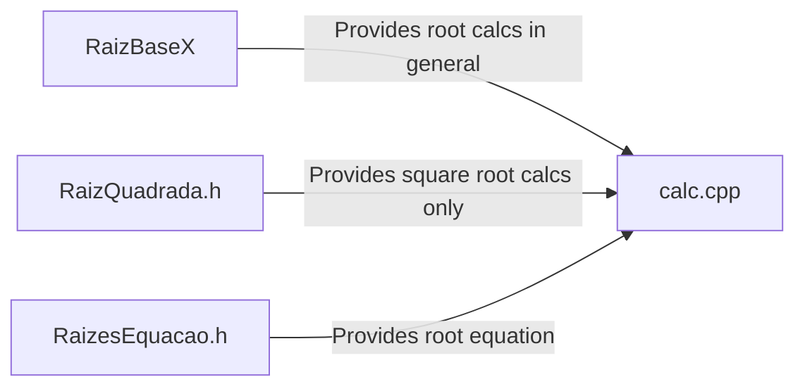

# CalCpp - A simple CLI scientific calculator in C++

  
  
  
  
  
  
  

In W.I.P

## About the project
This is an opensource scientific calculator made from scratch by me :)
Feel free to fork or contribute with this project

## Code diagram

That code is pretty simple  😅

